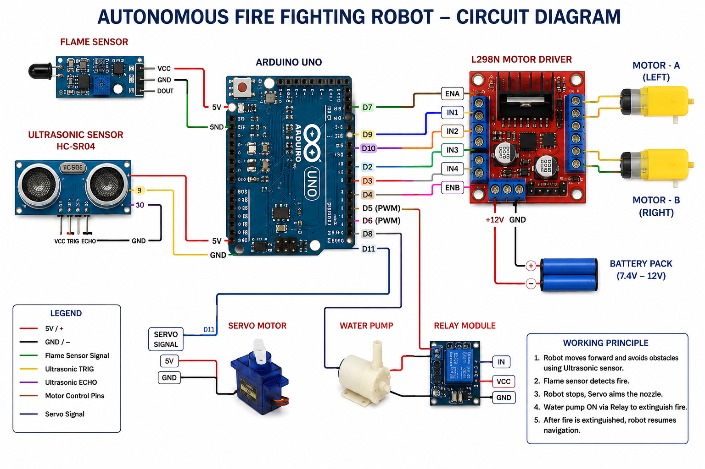
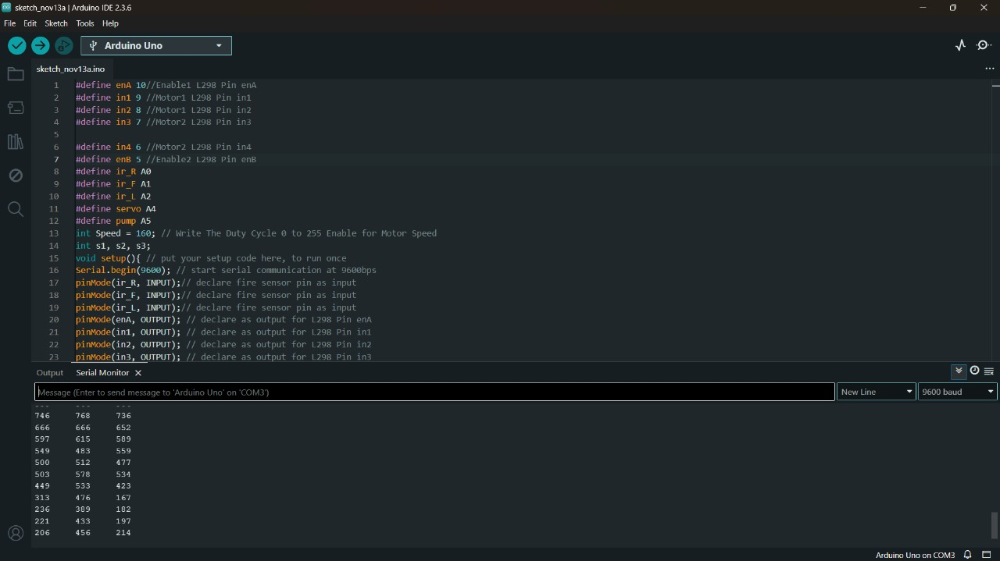
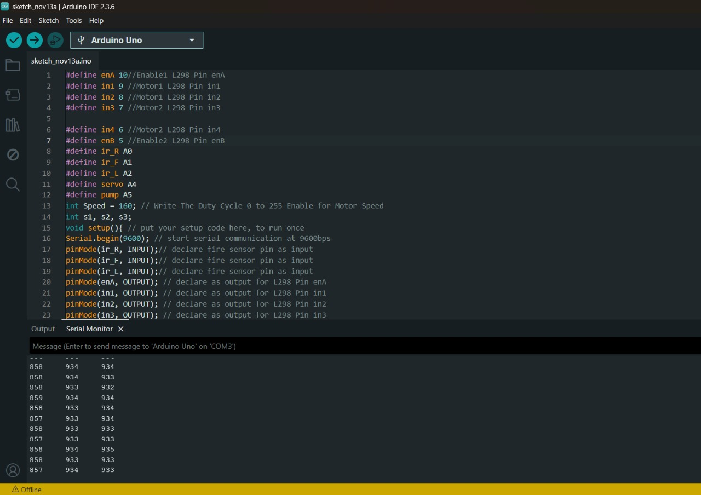

#  Autonomous Fire-Fighting Robot 

A low-cost embedded robotic system designed for **autonomous fire detection, navigation, and suppression** in hazardous environments with minimal human intervention.

---

##  Overview

This project presents the design and development of an **Arduino-based autonomous fire-fighting robot** capable of detecting fire, avoiding obstacles, and extinguishing flames efficiently.

The system integrates sensors, actuators, and control algorithms to operate intelligently in real-time environments.

---

##  Objectives

- Detect fire using flame sensors  
- Navigate autonomously in obstacle-filled environments  
- Extinguish fire using an automated mechanism  
- Reduce human risk in hazardous situations  
- Build a cost-effective and scalable solution  

---

##  Core Concepts

- Embedded Systems  
- Sensor Interfacing  
- Autonomous Navigation  
- Obstacle Avoidance Algorithms  
- Real-Time Processing  
- Actuator Control  
- Robotics & Automation  

---

##  Hardware Components

- **Arduino Uno** – Microcontroller (brain of the system)  
- **Flame Sensor** – Detects fire  
- **Ultrasonic Sensor (HC-SR04)** – Obstacle detection  
- **L298N Motor Driver** – Controls motor movement  
- **DC Motors & Wheels** – Robot mobility  
- **Servo Motor** – Controls direction of water spray  
- **Water Pump** – Fire extinguishing mechanism  
- **Battery (7.4V–12V)** – Power supply  

---

##  Software Implementation

- Language: **C/C++ (Arduino IDE)**  

### Key Modules:

1. **Sensor Initialization**
   - Configure flame and ultrasonic sensors  

2. **Navigation Logic**
   - Move forward and avoid obstacles  

3. **Fire Detection**
   - Continuously monitor flame sensor input  

4. **Fire Suppression**
   - Stop movement  
   - Align servo  
   - Activate water pump  

5. **System Loop**
   - Repeat detection and navigation  

---

##  Working Principle

1. Robot scans surroundings continuously  
2. Detects obstacles and navigates safely  
3. Identifies fire using flame sensor  
4. Stops and positions toward fire  
5. Activates pump to extinguish fire  
6. Resumes movement after suppression  

---

##  Project Images

---

##  Documentation

 [Project Report](docs/Fire_Fighting_Robot_Report_github.pdf)

---

##  Results & Performance

-  Fire Detection Accuracy: ~90%  
-  Response Time: < 3 seconds  
-  Successful obstacle avoidance  
-  Battery backup: ~30–40 minutes  

Flame

No Flame

Demo

---

## How to Run

### Hardware Setup
- Connect all components as shown in `hardware/circuit.png`

### Upload Code
1. Open Arduino IDE
2. Open `software/main_code.ino`
3. Select Arduino Uno
4. Upload code

### Power ON
- Connect battery supply
- Robot starts autonomous navigation

##  Applications

- Industrial fire safety systems  
- Smart homes and buildings  
- Hazardous environments (labs, factories)  
- Defense and surveillance  
- Agricultural storage safety  

---

##  Future Scope

- AI-based fire detection (camera + ML)  
- IoT-based remote monitoring  
- LiDAR-based navigation  
- Swarm robotics (multiple robots)  
- Improved power efficiency  

---

##  Skills Gained

- Embedded Systems Development  
- Arduino Programming  
- Sensor Integration  
- Robotics Design  
- Problem Solving & Debugging 
- System Design Thinking  

---

##  Team

- Kesihambigai S 

---

##  License
MIT License

##  Institution

Vellore Institute of Technology (VIT)

---

##  Support

If you like this project, consider giving it a ⭐ on GitHub!
