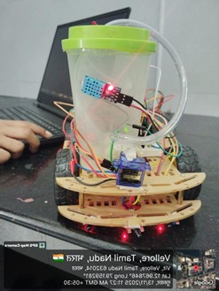
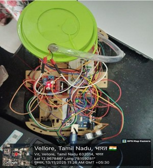
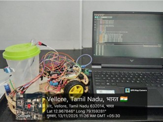
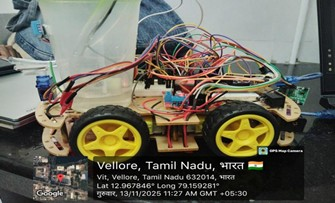

# Autonomous Fire-Fighting Robot

An Arduino-based autonomous robot designed to detect, navigate toward, and extinguish fire with minimal human intervention.

---

## Overview

This project focuses on developing a low-cost embedded robotic system capable of operating in hazardous environments.  
The robot uses sensors and control logic to automatically detect fire and suppress it efficiently.

---

## Features

- 🔥 Real-time fire detection using flame sensor  
- 🚧 Obstacle avoidance using ultrasonic sensor  
- 🤖 Autonomous navigation  
- 💧 Automatic fire extinguishing mechanism (pump + servo)  
- 🔋 Battery-powered system  

---

## Working Principle

1. The robot continuously scans its surroundings  
2. Detects obstacles and navigates safely  
3. Identifies fire using flame sensor  
4. Stops and aligns toward fire source  
5. Activates pump to extinguish fire  
6. Resumes operation after suppression  

---

## System Architecture

- Arduino Uno (Microcontroller)
- Flame Sensor (Fire Detection)
- Ultrasonic Sensor (Obstacle Avoidance)
- L298N Motor Driver
- DC Motors (Movement)
- Servo Motor (Direction control)
- Water Pump (Fire suppression)
- Battery (Power supply)

---

## Project Images

---

## Documentation

📘 [Project Report](docs/Fire_Fighting_Robot_Report_github.pdf)

---

## Results

- ✅ Fire detection accuracy: ~90%  
- ✅ Fast response time  
- ✅ Successful obstacle avoidance  
- ✅ Stable navigation in test environment  

---

## Applications

- Industrial safety systems  
- Fire detection in hazardous environments  
- Smart homes and buildings  
- Defense and surveillance systems  

---

##  Future Scope

- AI-based fire detection using camera  
- IoT integration for remote monitoring  
- LiDAR-based navigation  
- Multi-robot coordination (Swarm robotics)  

---

## Team

- Kesihambigai S 

---

## Institution

Vellore Institute of Technology (VIT)

---

## 📜 License

This project is licensed under the MIT License.
